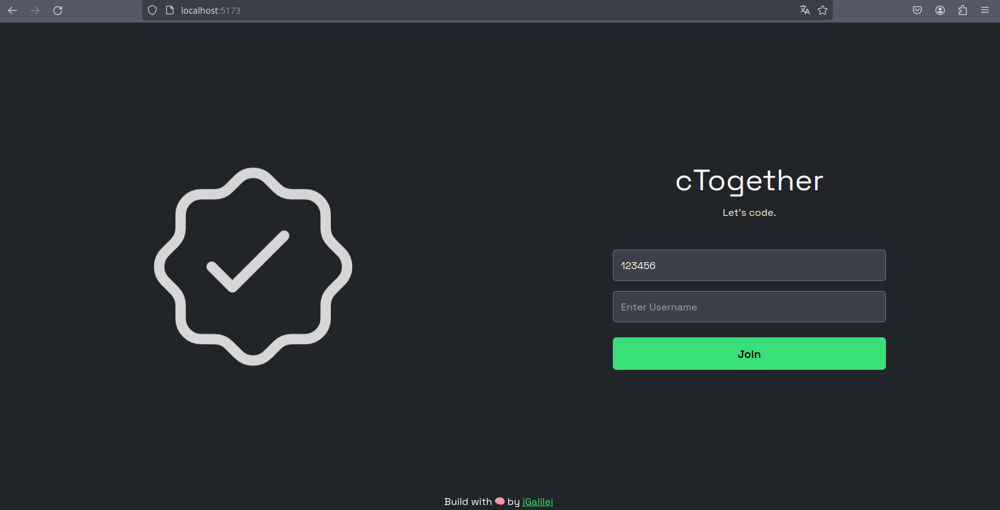
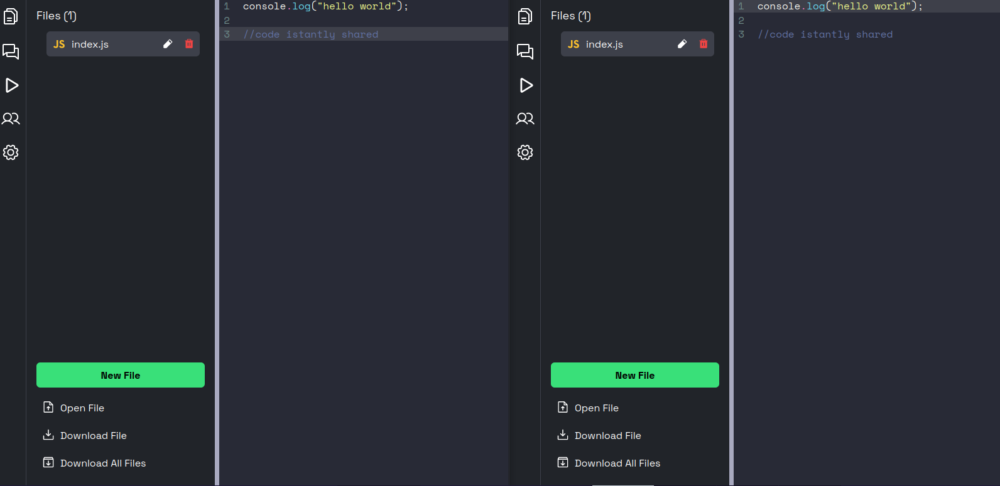
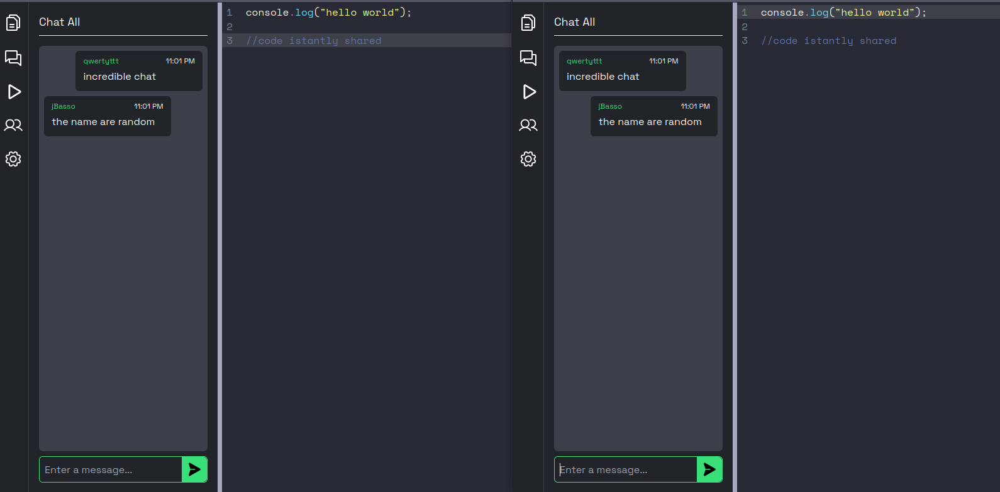

# cTogether





cTogether is a multyuser code editor where users can seamlessly code together.

## Features

- Code Run
- Multiple themes, code languages
- Real-time collaboration
- Syntax highlighting
- Auto suggestion
- Chat

## Installation

1. **Download the repo** 

2. **Install dependencies:**
    ```bash
    cd client 
    npm install
    ```
    ```bash
    cd server
    npm install
    ```
3. **Start the system:**  
    ```bash
    cd client
    npm run dev
    ```
    ```bash
    cd server
    npm run dev
    ```
4. **Access the application:**
   Default url
    ```bash
    http://localhost:5173/
    ```

## Settings
Change the .env file to set the ip of the client and server.<br>
**Client**: set the url to where is the server
```bash
VITE_BACKEND_URL= http://localhost:3000/
```
**Server**: set the port of the server
```bash
PORT=3000
```

## About Developer
**Jacopo Basso Ricci**: the developer under jGalilei